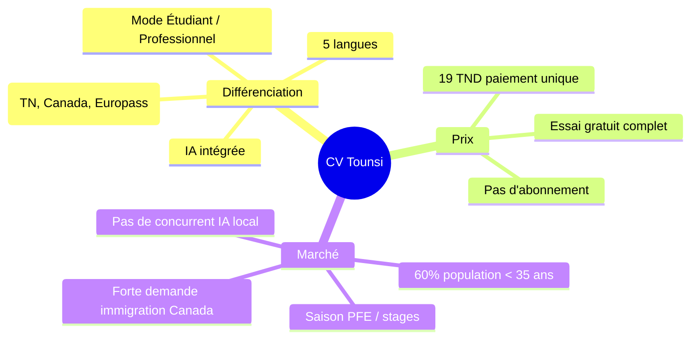
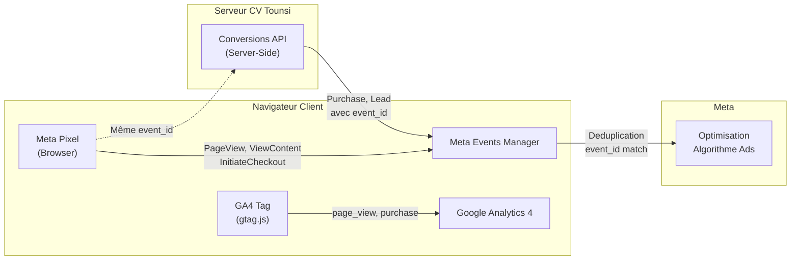
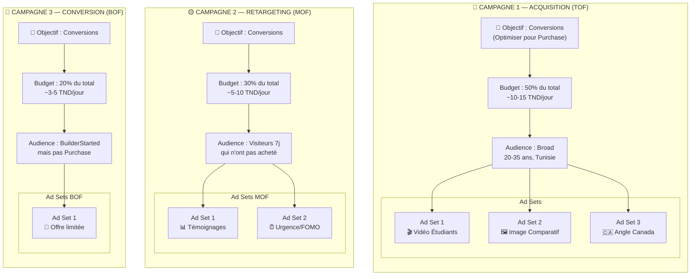
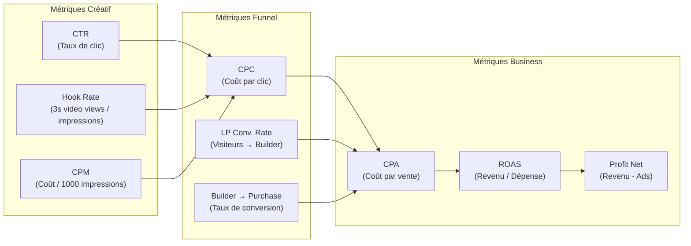

# 📊 Guide Complet — Campagne Meta Ads pour CV Tounsi

> **Objectif :** Lancer une campagne Meta Ads performante, générer des ventes (19 TND/CV), et scaler de manière profitable sur le marché tunisien.
> **Date :** 25 Août 2026
> **Auteur :** Antigravity — Analyse Approfondie
> **Produit :** CV Tounsi — Création de CV assistée par IA (19 TND, paiement unique)

---

## Table des Matières

1. [Analyse du Marché Tunisien](#1-analyse-du-marché-digital-tunisien)
2. [Personas & Audiences Cibles](#2-personas--audiences-cibles)
3. [Infrastructure Technique](#3-infrastructure-technique-obligatoire)
4. [Structure de Campagne](#4-structure-de-campagne)
5. [Stratégie Créative](#5-stratégie-créative-les-publicités)
6. [Copy & Textes Publicitaires](#6-copy--textes-publicitaires)
7. [Landing Page & Conversion](#7-landing-page--optimisation-de-conversion)
8. [Budget & Planification](#8-budget--planification)
9. [KPIs & Tableaux de Bord](#9-kpis--tableaux-de-bord)
10. [Scaling & Optimisation](#10-scaling--optimisation-continue)
11. [Erreurs à Éviter](#11-erreurs-courantes-à-éviter)
12. [Checklist de Lancement](#12-checklist-de-lancement)

---

## 1. Analyse du Marché Digital Tunisien

### 📱 Chiffres Clés (2025-2026)

| Indicateur | Valeur | Impact pour CV Tounsi |
|:---|:---|:---|
| Population | ~12.4 millions | Marché de niche mais dense |
| Internautes | ~10.5 millions (85% pénétration) | Large audience potentielle |
| Connexions mobiles | ~15.7 millions (128% population) | **Mobile-first obligatoire** |
| Utilisateurs réseaux sociaux | ~7.83 millions (63%) | Canal d'acquisition principal |
| Utilisateurs Facebook | N°1 en Tunisie (~21M visites/mois) | **Plateforme prioritaire** |
| Utilisateurs Instagram | ~4.45 millions | Canal secondaire stratégique |
| Population < 35 ans | **60%** | Cœur de cible CV Tounsi |
| Trafic mobile | **90%+** des utilisateurs | Optimisation mobile critique |

### 💰 Benchmarks Publicitaires Tunisie

| Métrique | Fourchette Tunisie | Objectif CV Tounsi |
|:---|:---|:---|
| **CPM** (Coût / 1000 impressions) | 3 – 8 TND | < 5 TND |
| **CPC** (Coût par clic) | 0.15 – 0.45 TND | < 0.25 TND |
| **CTR** (Taux de clic) | 1% – 3% | > 2% |
| **Taux de conversion LP** | 2% – 5% | > 3% |
| **CPA** (Coût par acquisition) | Variable | < 10 TND (objectif) |
| **ROI cible** | 4:1 | 1.9:1 minimum (19 TND / 10 TND CPA) |

> [!IMPORTANT]
> **Avec un produit à 19 TND et un CPA cible de 10 TND, votre marge brute est de 9 TND par vente.** C'est viable pour un produit digital sans coût marginal, mais chaque dinar économisé sur le CPA est du profit direct.

### 🏆 Avantages Concurrentiels de CV Tounsi



---

## 2. Personas & Audiences Cibles

### 🎯 Les 4 Personas Principaux

#### Persona 1 — L'Étudiant PFE / Stage (🎓 Priorité Haute)

| Caractéristique | Détail |
|:---|:---|
| **Âge** | 20-25 ans |
| **Situation** | Étudiant(e) en dernière année, cherche un PFE ou premier stage |
| **Douleur principale** | "Je n'ai aucune expérience, je ne sais pas quoi mettre sur mon CV" |
| **Déclencheur** | Fin de semestre, deadline de candidature PFE |
| **Où le trouver** | Facebook, Instagram, groupes universitaires tunisiens |
| **Pouvoir d'achat** | 19 TND = 1 repas en cafétéria × 4 → acceptable si résultat tangible |
| **Message clé** | "Transforme tes projets universitaires en expériences valorisantes" |
| **Saisonnalité** | 📈 Pic en Septembre-Novembre et Février-Avril |

#### Persona 2 — Le Jeune Diplômé en Recherche d'Emploi (💼 Priorité Haute)

| Caractéristique | Détail |
|:---|:---|
| **Âge** | 23-30 ans |
| **Situation** | Diplômé(e) récent(e), 0-3 ans d'expérience, cherche un CDI |
| **Douleur principale** | "J'envoie des dizaines de CV sans réponse" |
| **Déclencheur** | Frustration de ne pas être rappelé(e) |
| **Où le trouver** | Facebook, LinkedIn, groupes emploi Tunisie |
| **Pouvoir d'achat** | 19 TND = investissement carrière → très acceptable |
| **Message clé** | "L'IA reformule tes missions en réalisations percutantes. +3 entretiens en 1 semaine." |
| **Saisonnalité** | 📈 Pic post-remise des diplômes (Juin-Septembre) |

#### Persona 3 — Le Candidat à l'Immigration Canada (🇨🇦 Priorité Moyenne)

| Caractéristique | Détail |
|:---|:---|
| **Âge** | 25-40 ans |
| **Situation** | Prépare son dossier Entrée Express / Permis de travail Canada |
| **Douleur principale** | "Le format canadien est différent, je ne sais pas comment enlever ma photo" |
| **Déclencheur** | Préparation active du dossier d'immigration |
| **Où le trouver** | Groupes Facebook "Tunisiens au Canada", "Immigration Canada Tunisie" |
| **Pouvoir d'achat** | 19 TND = rien par rapport au coût total d'un dossier d'immigration |
| **Message clé** | "CV conforme IRCC : sans photo, sans âge, centré compétences — validé Canada." |
| **Saisonnalité** | 📈 Toute l'année (tirages Entrée Express réguliers) |

#### Persona 4 — Le Professionnel en Transition (🔄 Priorité Basse)

| Caractéristique | Détail |
|:---|:---|
| **Âge** | 30-45 ans |
| **Situation** | En poste mais cherche mieux, ou en reconversion |
| **Douleur principale** | "Mon CV date de 5 ans et ne reflète plus mon niveau actuel" |
| **Déclencheur** | Offre d'emploi intéressante aperçue |
| **Pouvoir d'achat** | 19 TND = facilement justifiable |
| **Message clé** | "Mettez à jour votre CV en 10 minutes avec l'IA." |

### 🎯 Configuration des Audiences dans Meta Ads Manager

```
📂 Audience 1 — Broad (Recommandé pour démarrer)
├── 🌍 Localisation : Tunisie
├── 👤 Âge : 20-35 ans
├── 🔤 Langue : Français, Arabe
└── 🎯 Ciblage : AUCUN (Broad — laisser l'algorithme trouver)

📂 Audience 2 — Étudiants (Test)
├── 🌍 Localisation : Grand Tunis, Sousse, Sfax, Monastir
├── 👤 Âge : 18-25 ans
├── 🎓 Centres d'intérêt : Stage, PFE, Université, Formation
└── 📱 Placements : Instagram Reels + Facebook Feed

📂 Audience 3 — Canada (Test)
├── 🌍 Localisation : Tunisie
├── 👤 Âge : 25-40 ans
├── 🇨🇦 Centres d'intérêt : Immigration Canada, Entrée Express, Visa
└── 📱 Placements : Facebook Feed + Instagram Feed

📂 Audience 4 — Retargeting (MOF/BOF)
├── 🔄 Visiteurs du site web (7 derniers jours)
├── 🔄 Événement : BuilderStarted mais pas CodeActivated
└── 📱 Placements : Tous les placements Meta
```

> [!TIP]
> **Commencez par l'Audience 1 (Broad).** En 2026, l'algorithme de Meta est suffisamment intelligent pour identifier vos meilleurs prospects à partir de vos créatifs. Le ciblage granulaire est souvent contre-productif car il réduit la taille du bassin d'apprentissage.

---

## 3. Infrastructure Technique Obligatoire

### 🔧 Architecture de Tracking



### ✅ Ce qui est déjà en place

| Composant | État | Référence |
|:---|:---|:---|
| Meta Pixel (fbevents.js) | ✅ Installé | `index.html:14-25` — Pixel ID: `1426962146006360` |
| Google Analytics 4 | ✅ Installé | `index.html:28-34` — ID: `G-WFNHB734S8` |
| `PageView` automatique | ✅ | `fbq('track', 'PageView')` |
| `ViewContent` (landing Ads) | ✅ | `AdsLanding.tsx:32` |
| `InitiateCheckout` (CTA clic) | ✅ | `AdsLanding.tsx:40` + `analytics.ts:58` |
| `Purchase` (code activé) | ✅ | `analytics.ts:70` — value: 19, currency: TND |
| `Contact` (WhatsApp clic) | ✅ | `analytics.ts:64` |
| `Lead` (PDF HD téléchargé) | ✅ | `analytics.ts:78` |
| Noscript fallback Pixel | ✅ | `index.html:39` |

### ⚠️ Ce qui manque (Critique pour la performance)

#### 1. Conversions API (CAPI) — 🔴 Priorité 1

> [!CAUTION]
> **Sans la Conversions API, vous perdez ~30-40% de vos données de conversion** à cause des bloqueurs de pub et des restrictions iOS. L'algorithme de Meta optimise mal avec des données incomplètes, ce qui augmente votre CPA de 20-30%.

**Implémentation recommandée :**

```typescript
// server/meta-capi.ts — À créer
import crypto from "node:crypto";

const META_PIXEL_ID = "1426962146006360";
const META_ACCESS_TOKEN = process.env.META_CAPI_TOKEN; // À obtenir dans Events Manager

interface CAPIEvent {
  event_name: string;
  event_time: number;
  event_id: string; // MÊME ID que le Pixel browser pour la déduplication
  event_source_url: string;
  action_source: "website";
  user_data: {
    em?: string[];   // Email hashé SHA256
    ph?: string[];   // Téléphone hashé SHA256
    fn?: string[];   // Prénom hashé SHA256
    client_ip_address?: string;
    client_user_agent?: string;
    fbc?: string;    // Facebook Click ID (du cookie _fbc)
    fbp?: string;    // Facebook Browser ID (du cookie _fbp)
  };
  custom_data?: {
    value?: number;
    currency?: string;
    content_name?: string;
  };
}

export async function sendCAPIEvent(event: CAPIEvent): Promise<void> {
  if (!META_ACCESS_TOKEN) return;
  
  try {
    const url = `https://graph.facebook.com/v22.0/${META_PIXEL_ID}/events`;
    await fetch(url, {
      method: "POST",
      headers: { "Content-Type": "application/json" },
      body: JSON.stringify({
        data: [event],
        access_token: META_ACCESS_TOKEN,
      }),
    });
  } catch (error) {
    console.error("[CAPI] Error sending event:", error);
  }
}

// Helper pour hasher les données utilisateur
export function hashForCAPI(value: string): string {
  return crypto.createHash("sha256").update(value.trim().toLowerCase()).digest("hex");
}
```

**Intégration dans la route `/api/validate-code` :**

```typescript
// Dans server/index.ts — Route validate-code (après validation réussie)
if (isValid) {
  // Envoyer l'événement Purchase via CAPI
  const eventId = `purchase_${Date.now()}_${Math.random().toString(36).slice(2)}`;
  
  await sendCAPIEvent({
    event_name: "Purchase",
    event_time: Math.floor(Date.now() / 1000),
    event_id: eventId, // Passer ce même ID au client pour la déduplication
    event_source_url: req.headers.referer || "https://cvtounsi.tn",
    action_source: "website",
    user_data: {
      client_ip_address: getClientIp(req),
      client_user_agent: req.headers["user-agent"] || "",
    },
    custom_data: {
      value: 19,
      currency: "TND",
      content_name: "CV Unlock",
    },
  });
  
  res.json({ valid: true, token, eventId }); // Retourner eventId au client
}
```

**Côté client — Passer le même `event_id` au Pixel :**

```typescript
// Dans le handler d'activation (Home.tsx)
if (result.valid) {
  // Utiliser le MÊME eventId pour la déduplication Pixel/CAPI
  window.fbq?.("track", "Purchase", 
    { value: 19, currency: "TND", content_name: "CV Unlock" },
    { eventID: result.eventId } // Déduplication avec le serveur
  );
}
```

#### 2. UTM Tracking — 🟡 Priorité 2

**Ajouter la lecture des paramètres UTM sur la landing page :**

```typescript
// Dans AdsLanding.tsx — useEffect au montage
useEffect(() => {
  const params = new URLSearchParams(window.location.search);
  const utm = {
    source: params.get("utm_source"),
    medium: params.get("utm_medium"),
    campaign: params.get("utm_campaign"),
    content: params.get("utm_content"),
    term: params.get("utm_term"),
  };
  
  // Stocker pour le tracking de conversion
  if (utm.source) {
    sessionStorage.setItem("cv_tounsi_utm", JSON.stringify(utm));
  }
  
  // Envoyer à GA4
  if (window.gtag && utm.source) {
    window.gtag("set", {
      campaign_source: utm.source,
      campaign_medium: utm.medium,
      campaign_name: utm.campaign,
    });
  }
}, []);
```

**Format des URLs dans vos publicités :**

```
https://cvtounsi.tn/offre?utm_source=facebook&utm_medium=paid&utm_campaign=etudiants_pfe_sept2026&utm_content=video_hook_a
```

#### 3. Facebook Cookie Consent — 🟢 Priorité 3

Pour la conformité et l'optimisation du Pixel, récupérer les cookies `_fbc` et `_fbp` :

```typescript
// Helper pour récupérer les cookies Facebook
function getFacebookCookies() {
  const cookies = document.cookie.split(";").reduce((acc, c) => {
    const [key, val] = c.trim().split("=");
    acc[key] = val;
    return acc;
  }, {} as Record<string, string>);
  
  return {
    fbc: cookies._fbc || null,
    fbp: cookies._fbp || null,
  };
}
```

---

## 4. Structure de Campagne

### 🏗️ Architecture en 3 Niveaux (TOF/MOF/BOF)



### Détail de chaque campagne

#### 🔵 Campagne 1 — Acquisition (TOF) — Top of Funnel

| Paramètre | Valeur |
|:---|:---|
| **Objectif** | Ventes (Conversions) — **PAS Trafic** |
| **Événement d'optimisation** | `Purchase` (CodeActivated) |
| **Type** | Advantage+ Sales (recommandé) ou Manuel |
| **Budget** | 10-15 TND/jour (Campaign Budget Optimization activé) |
| **Audience** | Broad — 20-35 ans — Tunisie — Français + Arabe |
| **Placements** | Advantage+ Placements (automatique) |
| **Enchère** | Coût le plus bas (démarrage) → Cost Cap ensuite |
| **Durée phase d'apprentissage** | 7 jours minimum (50 conversions cibles) |

**Ad Sets à tester (3 angles) :**

| Ad Set | Angle | Cible implicite |
|:---|:---|:---|
| **Étudiants PFE** | "Ton CV étudiant, sublimé par l'IA" | 20-25 ans, Instagram Reels |
| **Comparatif Avant/Après** | "Arrêtez d'envoyer des CV Word" | 23-30 ans, Facebook Feed |
| **Format Canada** | "CV conforme IRCC en 10 min" | 25-40 ans, Facebook Feed |

#### 🟡 Campagne 2 — Retargeting (MOF) — Middle of Funnel

| Paramètre | Valeur |
|:---|:---|
| **Objectif** | Ventes (Conversions) |
| **Événement** | `Purchase` |
| **Budget** | 5-10 TND/jour |
| **Audience** | Custom Audience : visiteurs du site 7-30 jours |
| **Exclusion** | Exclure les acheteurs (Purchase) |
| **Fréquence max** | 3 impressions / 7 jours |

**Créatifs :** Témoignages clients (Amine K., Sarra M., Youssef B.) + Rappel du prix.

#### 🔴 Campagne 3 — Conversion (BOF) — Bottom of Funnel

| Paramètre | Valeur |
|:---|:---|
| **Objectif** | Ventes (Conversions) |
| **Événement** | `Purchase` |
| **Budget** | 3-5 TND/jour |
| **Audience** | Custom : `BuilderStarted` mais pas `Purchase` (3 derniers jours) |
| **Urgence** | "Votre CV est presque prêt — finalisez-le maintenant" |

---

## 5. Stratégie Créative (Les Publicités)

### 🎨 Principes Fondamentaux

> **"En 2026, votre créatif EST votre ciblage."** L'algorithme de Meta utilise vos visuels et textes pour identifier automatiquement les bonnes personnes. Un bon créatif > un bon ciblage.

### 📐 Formats et Spécifications

| Format | Ratio | Utilisation | Priorité |
|:---|:---|:---|:---|
| **Vidéo verticale** | 9:16 | Instagram Reels, Stories | 🔴 Haute |
| **Vidéo Feed** | 4:5 | Facebook Feed, Instagram Feed | 🔴 Haute |
| **Image statique** | 1:1 ou 4:5 | Facebook Feed, placement universel | 🟡 Moyenne |
| **Carrousel** | 1:1 | Montrer les 3 templates | 🟢 Optionnelle |

### 🎬 Stratégie Vidéo — Les 3 Secondes Fatidiques

> **75% des utilisateurs regardent les vidéos sans le son.** Ajoutez TOUJOURS des sous-titres larges et lisibles.

#### Structure d'une vidéo performante (15-30 secondes)

```
Seconde 0-3  → 🎣 HOOK (Arrêter le scroll)
Seconde 3-10 → 💡 PROBLÈME + SOLUTION
Seconde 10-20 → ✨ DÉMONSTRATION (Screen recording du produit)
Seconde 20-25 → 📊 PREUVE SOCIALE
Seconde 25-30 → 🎯 CTA (Appel à l'action)
```

#### 12 Hooks Vidéo à Tester

| # | Hook (3 premières secondes) | Angle | Persona |
|:---|:---|:---|:---|
| H1 | 🎥 "Tu envoies des CV et personne ne te rappelle ? Voilà pourquoi." | Frustration | Jeune diplômé |
| H2 | 🎥 "J'ai fait 15 candidatures sans réponse. Puis j'ai découvert ça." | Storytelling | Jeune diplômé |
| H3 | 🎥 "Ton CV Word ne passe même pas le logiciel de recrutement." | Éducation | Tous |
| H4 | 🎥 "PFE dans 2 mois et ton CV est encore vide ? Regarde." | Urgence | Étudiant |
| H5 | 🎥 "L'IA a réécrit mon CV en 1 clic. Voici le résultat." | Curiosité | Tous |
| H6 | 🎥 "CV pour le Canada : tu mets encore ta photo ? Erreur fatale." | Peur/Éducation | Canada |
| H7 | 🎥 "19 TND pour un CV professionnel fait par l'IA. Sérieux." | Prix shock | Tous |
| H8 | 🎥 "3 entretiens en 1 semaine après avoir changé MON CV." | Résultat | Jeune diplômé |
| H9 | 🎥 "Avant : 'Je suis motivé'. Après avec l'IA : résultat 🔥" | Avant/Après | Tous |
| H10 | 🎥 "Tu prépares ton dossier Entrée Express ? Ce CV est validé IRCC." | Spécifique | Canada |
| H11 | 🎥 "Pourquoi les recruteurs jettent ton CV en 6 secondes." | Statistique | Tous |
| H12 | 🎥 "Étudiant(e) : voici comment transformer tes projets en CV pro." | Solution | Étudiant |

### 🖼️ Créatifs Image — Templates

#### Template 1 : Comparatif Avant/Après (4:5)

```
┌──────────────────────────────────┐
│ ❌ CV Word classique              │
│ [Screenshot CV basique flou]      │
│                                    │
│ ─── VS ───                        │
│                                    │
│ ✅ CV Tounsi optimisé par l'IA    │
│ [Screenshot CV Tounsi net]        │
│                                    │
│ 🎯 19 TND · Paiement unique      │
│ Créer mon CV → cvtounsi.tn       │
└──────────────────────────────────┘
```

#### Template 2 : Social Proof (1:1)

```
┌──────────────────────────────────┐
│ ⭐⭐⭐⭐⭐                      │
│                                    │
│ "3 entretiens en 1 semaine        │
│  après avoir refait mon CV        │
│  sur CV Tounsi."                   │
│                                    │
│ — Amine K., Ingénieur, Tunis     │
│                                    │
│ 🫒 CV Tounsi · 19 TND            │
│ Essai 100% gratuit               │
└──────────────────────────────────┘
```

#### Template 3 : 3 Templates (Carrousel 1:1)

```
Slide 1 → 🇹🇳 CV Professionnel Tunisien
Slide 2 → 🇨🇦 Format Canadien IRCC (sans photo)
Slide 3 → 🇪🇺 Format Europass (Union Européenne)
Slide 4 → 🎯 Les 3 inclus pour 19 TND · Créer mon CV →
```

### 📊 Matrice de Test Créatif (Semaine 1)

| | Hook A (Frustration) | Hook B (IA/Tech) | Hook C (Prix) |
|:---|:---|:---|:---|
| **Vidéo 9:16** | ✅ Tester | ✅ Tester | ✅ Tester |
| **Image 4:5** | ✅ Tester | — | ✅ Tester |
| **Carrousel 1:1** | — | — | ✅ Tester |

> **Total : 6 créatifs minimum à lancer en Semaine 1.** L'algorithme a besoin de variété pour identifier le gagnant.

---

## 6. Copy & Textes Publicitaires

### 📝 Structure du Copy Performant

```
🎣 HOOK (1 phrase d'accroche — doit arrêter le scroll)
↓
💡 PROBLÈME (Identifier la douleur de votre cible)
↓
✨ SOLUTION (Présenter CV Tounsi comme LA réponse)
↓
📊 PREUVE (Chiffre, témoignage, ou résultat)
↓
🎯 CTA (Appel à l'action clair et unique)
```

### Exemples de Copy Complets (Prêts à utiliser)

#### Copy 1 — Jeune Diplômé (Primary Text)

```
Tu envoies des CV et personne ne te rappelle ? 😤

Le problème n'est pas TOI. C'est ton CV.

80% des CV sont rejetés par les logiciels de recrutement (ATS) 
avant même qu'un humain ne les voie.

CV Tounsi utilise l'intelligence artificielle pour :
✅ Reformuler tes missions en réalisations percutantes
✅ Optimiser la mise en page A4 irréprochable
✅ Créer un CV compatible ATS

Amine, ingénieur à Tunis, a décroché 3 entretiens 
en 1 semaine après avoir refait son CV.

👉 Essai 100% gratuit · Déblocage PDF : 19 TND (paiement unique)

Créer mon CV maintenant ↓
```

**Headline :** `Créez votre CV professionnel avec l'IA — 19 TND`
**Description :** `Essai gratuit · 3 modèles · 5 langues · Export PDF A4 HD`

---

#### Copy 2 — Étudiant PFE / Stage

```
PFE dans 2 mois et ton CV est encore vide ? 😬

Pas de panique. Le mode Étudiant de CV Tounsi est fait pour toi.

L'IA transforme tes projets universitaires en expériences 
professionnelles valorisantes :

🎓 Adapté aux profils sans expérience
🤖 L'IA sublime tes compétences en 1 clic  
📄 PDF A4 impeccable prêt à envoyer
💰 19 TND seulement — pas d'abonnement

"L'IA m'a aidée à décrire mes projets comme de vraies 
réalisations pro." — Sarra M., Étudiante Finance, Sfax

Essaye gratuitement ↓
```

**Headline :** `Mode Étudiant : CV PFE & Stage optimisé par l'IA`
**Description :** `Essai gratuit complet · Déblocage 19 TND`

---

#### Copy 3 — Immigration Canada 🇨🇦

```
Tu prépares ton dossier Entrée Express Canada ? 🇨🇦

Savais-tu que le CV canadien est complètement différent du CV tunisien ?

❌ Pas de photo
❌ Pas de date de naissance  
❌ Pas de situation familiale
✅ Centré sur les compétences mesurables et les résultats chiffrés

CV Tounsi génère automatiquement un CV conforme au format 
canadien (IRCC) en français ou en anglais.

"Le modèle Canadien sans photo m'a fait gagner un temps 
précieux pour mon dossier." — Youssef B.

👉 Les 3 formats (Tunisie, Canada, Europass) inclus pour 19 TND

Créer mon CV Canada →
```

**Headline :** `CV Format Canadien IRCC — Conforme Entrée Express`
**Description :** `Sans photo · Sans âge · Centré compétences · 19 TND`

---

#### Copy 4 — Retargeting (Visiteurs qui n'ont pas acheté)

```
Vous avez commencé à créer votre CV sur CV Tounsi 
mais n'avez pas encore finalisé ? 

Votre CV est sauvegardé et vous attend 🫒

📌 Rappel : L'export PDF HD est à seulement 19 TND
📌 Paiement unique — pas d'abonnement
📌 Paiement via WhatsApp, D17 ou Flouci

+2 500 CVs déjà créés en Tunisie ⭐ 4.9/5

Finalisez votre CV maintenant ↓
```

**Headline :** `Votre CV vous attend — Finalisez-le maintenant`

---

#### Copy 5 — Copy Court pour Instagram Stories/Reels

```
L'IA a réécrit mon CV.
3 entretiens en 1 semaine. 🔥

Essai gratuit · 19 TND pour le PDF HD
Lien en bio ↓
```

---

## 7. Landing Page & Optimisation de Conversion

### 📊 Audit de votre Landing Page Actuelle (`/offre`)

| Élément | État | Recommandation |
|:---|:---|:---|
| **Hero Section** (H1 + CTA) | ✅ Excellent | Texte percutant, CTA bien visible |
| **Social Proof** (étoiles + chiffre) | ✅ Bon | "4.9/5 — 2 500+ CVs" |
| **Comparatif Avant/Après** | ✅ Très bon | Section différenciante |
| **3 Formats en cartes** | ✅ Bon | Badge "Très Demandé" sur Canada |
| **Témoignages** | ✅ 3 témoignages | Crédibles et diversifiés |
| **Tarification claire** | ✅ Excellent | 19 TND + "Paiement unique" |
| **FAQ** | ✅ 4 questions | Couvre les objections principales |
| **Sticky Mobile CTA** | ✅ Excellent | Barre fixe en bas mobile |
| **Liens de fuite** | ⚠️ Minimal | Seuls liens = Privacy + CGU (bien) |
| **Vitesse de chargement** | ❓ À tester | Critical pour mobile Tunisie |
| **Proof vidéo / GIF** | ❌ Manquant | Ajouter une démo visuelle du produit |
| **Compteur de CVs créés** | ❌ Manquant | Ajouter un compteur dynamique |
| **Badge de confiance** | ❌ Manquant | Ajouter "🔒 Paiement sécurisé" |
| **Timer d'urgence** | ❌ Manquant | "Offre valable ce mois" |

### 🎯 Optimisations Prioritaires

#### 1. Ajouter une démo visuelle animée (GIF/Vidéo)

Le visiteur doit VOIR le produit en action dans les 5 premières secondes. Ajoutez un GIF ou une vidéo courte (5-10s) montrant :
- L'utilisateur tape du texte
- Clic sur "Améliorer avec l'IA"
- Le texte est transformé instantanément
- Le CV rendu final A4

#### 2. Compteur de social proof dynamique

```
"🔥 2 847 CVs créés cette semaine en Tunisie"
```

Ce compteur peut être alimenté par les vraies stats de `GET /api/admin/stats`.

#### 3. Garantie et réduction du risque

```
✅ Essai complet 100% gratuit
✅ Vous ne payez que si vous êtes satisfait du résultat
✅ Assistance WhatsApp en < 5 min
```

#### 4. Message de conformité pour la continuité Ads → LP

> [!IMPORTANT]
> **Règle d'or :** Le message de votre publicité DOIT correspondre exactement au message de votre landing page. Si votre pub dit "CV pour le Canada", la landing page doit montrer le format Canada en premier. Cela s'appelle la **continuité du message** et peut améliorer votre taux de conversion de 30-50%.

**Solution :** Créer des variantes de la landing page avec des paramètres URL :

```
/offre?angle=student   → Section "Mode Étudiant" mise en avant
/offre?angle=canada    → Section "Format Canadien" mise en avant
/offre?angle=general   → Version par défaut
```

---

## 8. Budget & Planification

### 💰 Plan de Budget sur 4 Semaines

#### Semaine 1 — Phase de Test (Budget : 50-70 TND)

| Jour | Budget/jour | Objectif |
|:---|:---|:---|
| J1-J3 | 7 TND/jour | Lancer 6 créatifs dans 1 campagne Advantage+ |
| J4-J5 | 10 TND/jour | Observer les premiers signaux (CTR, CPC) |
| J6-J7 | 12 TND/jour | Identifier les 2 meilleurs créatifs |

**Objectifs Semaine 1 :**
- ✅ Collecter 1000+ impressions par créatif
- ✅ Identifier le meilleur hook (CTR > 2%)
- ✅ Premiers clics vers la landing page
- ✅ Données suffisantes pour le Pixel (50+ événements ViewContent)

#### Semaine 2 — Phase d'Apprentissage (Budget : 70-100 TND)

| Jour | Budget/jour | Objectif |
|:---|:---|:---|
| J8-J10 | 10 TND/jour | Couper les 2-3 créatifs les moins performants |
| J11-J14 | 12-15 TND/jour | Laisser l'algorithme sortir de la phase d'apprentissage |

**Objectifs Semaine 2 :**
- ✅ Sortir de la "Learning Phase" (50 conversions idéalement, sinon 50 clics)
- ✅ Premières ventes (objectif : 3-5 ventes)
- ✅ CPA initial < 15 TND

#### Semaine 3 — Phase d'Optimisation (Budget : 100-120 TND)

| Jour | Budget/jour | Objectif |
|:---|:---|:---|
| J15-J17 | 12-15 TND/jour | Lancer la campagne Retargeting (MOF) |
| J18-J21 | 15-20 TND/jour | Augmenter budget sur les winners |

**Objectifs Semaine 3 :**
- ✅ CPA stabilisé < 12 TND
- ✅ Retargeting actif (audiences suffisantes)
- ✅ 8-15 ventes cumulées

#### Semaine 4 — Phase de Scaling Initial (Budget : 100-150 TND)

| Jour | Budget/jour | Objectif |
|:---|:---|:---|
| J22-J28 | 15-25 TND/jour | Scale les winners, lancer de nouveaux créatifs |

**Objectifs Semaine 4 :**
- ✅ CPA < 10 TND
- ✅ ROAS > 1.9 (rentable)
- ✅ 15-25 ventes cumulées
- ✅ Pipeline de nouveaux créatifs prêt

### 📊 Résumé Budget Total (4 semaines)

| Poste | Coût |
|:---|:---|
| **Budget Ads Semaine 1** | 50-70 TND |
| **Budget Ads Semaine 2** | 70-100 TND |
| **Budget Ads Semaine 3** | 100-120 TND |
| **Budget Ads Semaine 4** | 100-150 TND |
| **Total Ads (4 semaines)** | **320-440 TND** |
| | |
| **Objectif ventes (4 sem)** | 30-50 ventes |
| **Revenu brut** | 570-950 TND |
| **Marge nette estimée** | 130-510 TND |

> [!TIP]
> **Commencez petit et scalez.** Il est préférable de dépenser 50 TND la première semaine et de valider votre funnel plutôt que de brûler 200 TND d'un coup sans données. Chaque dinar dépensé sans tracking fonctionnel est un dinar perdu.

---

## 9. KPIs & Tableaux de Bord

### 📈 Métriques à Surveiller Quotidiennement



### 🚦 Seuils de Décision

| Métrique | 🟢 Bon | 🟡 Ajuster | 🔴 Couper |
|:---|:---|:---|:---|
| **CTR** | > 2% | 1-2% | < 1% |
| **Hook Rate (3s)** | > 30% | 15-30% | < 15% |
| **CPC** | < 0.25 TND | 0.25-0.50 TND | > 0.50 TND |
| **CPM** | < 5 TND | 5-8 TND | > 8 TND |
| **LP Conv. Rate** | > 5% | 2-5% | < 2% |
| **CPA** | < 8 TND | 8-12 TND | > 15 TND |
| **ROAS** | > 2.5x | 1.5-2.5x | < 1.5x |
| **Fréquence** | < 2 | 2-3 | > 3 (fatigue) |

### 🔍 Arbre de Diagnostic

```
CPA trop élevé ?
├── CTR < 1% → Le CRÉATIF ne fonctionne pas
│   └── Action : Changer le hook / tester d'autres angles
├── CTR > 2% mais LP Conv < 2% → La LANDING PAGE ne convertit pas
│   └── Action : Optimiser la landing page (vitesse, CTA, message)
├── LP Conv > 5% mais peu de Purchase → Le PAYWALL bloque
│   └── Action : Simplifier le processus de paiement / réduire la friction
└── Tout est bon mais CPM élevé → AUDIENCE saturée
    └── Action : Élargir l'audience ou changer de créatif
```

---

## 10. Scaling & Optimisation Continue

### 📈 Les 3 Leviers de Scaling

#### Levier 1 — Scaling Vertical (Augmenter le budget)

```
Règle : Augmentez de maximum 20% tous les 3-4 jours
```

| Jour | Budget | Règle |
|:---|:---|:---|
| J1 | 10 TND/jour | Démarrage |
| J4 | 12 TND/jour | +20% si CPA stable |
| J7 | 14 TND/jour | +20% si CPA stable |
| J10 | 17 TND/jour | +20% si CPA stable |
| J14 | 20 TND/jour | +20% si CPA stable |

> [!WARNING]
> **Ne doublez JAMAIS votre budget d'un coup.** L'algorithme Meta repasse en phase d'apprentissage et vos résultats seront instables pendant 3-5 jours. Augmentez progressivement.

#### Levier 2 — Scaling Horizontal (Nouveaux créatifs)

```
Semaine 1 : 6 créatifs → identifier 2 gagnants
Semaine 2 : Couper 4, garder 2 → ajouter 4 nouveaux
Semaine 3 : Itérer : nouveaux hooks sur le même body gagnant
Semaine 4 : Nouveau cycle complet de test
```

**Cycle de renouvellement :** Un créatif performant fatigue après ~21 jours. Préparez toujours 2-3 nouveaux créatifs d'avance.

#### Levier 3 — Scaling par Audience

```
Mois 1 : Tunisie Broad (20-35 ans)
Mois 2 : Ajouter Lookalike 1% des acheteurs
Mois 3 : Tester Tunisiens à l'étranger (France, Canada, Allemagne)
Mois 4 : Ouvrir les pays voisins (Algérie, Maroc) si pertinent
```

### 🔄 Routine Hebdomadaire d'Optimisation

| Jour | Action |
|:---|:---|
| **Lundi** | Analyser les KPIs de la semaine précédente dans Ads Manager |
| **Mardi** | Couper les créatifs avec CTR < 1% ou CPA > 15 TND |
| **Mercredi** | Préparer 2-3 nouveaux créatifs (vidéo + image) |
| **Jeudi** | Lancer les nouveaux créatifs en test |
| **Vendredi** | Ajuster les budgets (+20% sur les winners) |
| **Samedi-Dimanche** | Observer sans toucher (laisser l'algorithme apprendre) |

---

## 11. Erreurs Courantes à Éviter

### ❌ Les 10 Erreurs Fatales

| # | Erreur | Pourquoi c'est grave | Solution |
|:---|:---|:---|:---|
| 1 | **Utiliser l'objectif "Trafic"** | Attire des clics de curieux, pas d'acheteurs | Toujours utiliser "Ventes/Conversions" |
| 2 | **Budget trop faible (< 5 TND/jour)** | L'algorithme n'a pas assez de données pour apprendre | Minimum 7 TND/jour par campagne |
| 3 | **Changer les créatifs tous les jours** | L'algorithme a besoin de stabilité (7 jours min) | Patience : attendre 500+ impressions |
| 4 | **Ciblage trop restrictif** | Réduit le bassin d'apprentissage | Commencer Broad, affiner après |
| 5 | **Pas de Conversions API** | Perd ~35% des données de conversion | Implémenter CAPI avant de lancer |
| 6 | **Envoyer le trafic vers la page d'accueil** | Page trop longue, trop de distractions | Toujours utiliser `/offre` (landing Ads) |
| 7 | **Ignorer le mobile** | 90%+ du trafic tunisien est mobile | Vérifier le site sur mobile réel |
| 8 | **Pas de retargeting** | Les visiteurs qui reviennent convertissent 3x plus | Lancer le retargeting dès semaine 2 |
| 9 | **Copy en derja sans tester** | La derja peut réduire la crédibilité pour un produit pro | Tester français formel vs derja |
| 10 | **Pas d'UTM tracking** | Impossible de savoir quelle pub génère les ventes | UTM obligatoire sur chaque lien |

---

## 12. Checklist de Lancement

### ✅ Avant de lancer votre première pub

#### Fondations Techniques
- [ ] Pixel Meta installé et vérifie (`fbq('track', 'PageView')` fonctionne)
- [ ] GA4 installé et reçoit des données
- [ ] **Conversions API (CAPI) configurée** avec déduplication `event_id`
- [ ] Événements personnalisés testés : `ViewContent`, `InitiateCheckout`, `Purchase`, `Contact`
- [ ] UTM tracking sur les URLs des publicités
- [ ] Test Events Tool de Meta valide les événements (Browser + Server)

#### Page de Destination
- [ ] Landing page `/offre` fonctionne correctement sur mobile
- [ ] Temps de chargement < 3 secondes (tester sur connexion 3G)
- [ ] CTA visible sans scroller (above the fold)
- [ ] Sticky CTA mobile fonctionnel
- [ ] Pages légales accessibles (Privacy + Terms)
- [ ] Lien WhatsApp fonctionne (`wa.me/21692067554`)

#### Business Manager Meta
- [ ] Compte publicitaire actif avec moyen de paiement valide (Carte Technologie)
- [ ] Domaine vérifié dans Business Manager
- [ ] Événements de conversion prioritaires configurés (Purchase en #1)
- [ ] Audiences custom créées (visiteurs site, BuilderStarted)

#### Créatifs
- [ ] Au moins 3 vidéos (9:16) avec sous-titres
- [ ] Au moins 2 images (4:5 ou 1:1) avec texte lisible
- [ ] Textes publicitaires rédigés (Primary text + Headline + Description)
- [ ] Chaque créatif a une URL avec UTM unique

#### Campagne
- [ ] Objectif : Ventes (Conversions)
- [ ] Événement d'optimisation : Purchase
- [ ] Budget : minimum 7 TND/jour
- [ ] Audience : Broad 20-35 ans Tunisie
- [ ] Placements : Advantage+ (automatique)
- [ ] Advantage+ Campaign Budget : Activé

---

## Annexe A — Calendrier Saisonnier Tunisien

| Période | Événement | Impact CV Tounsi | Action |
|:---|:---|:---|:---|
| **Sept-Nov** | Rentrée universitaire + recherche PFE | 📈📈📈 Très fort | Ads Étudiants + PFE |
| **Déc-Jan** | Examens + fin de semestre | 📉 Faible | Réduire budget |
| **Fév-Avr** | 2ème semestre + recherche stages été | 📈📈 Fort | Ads Étudiants + Stages |
| **Mai-Juin** | Remise des diplômes + emploi | 📈📈📈 Très fort | Ads Jeunes diplômés |
| **Juil-Août** | Vacances + préparation immigration | 📈 Moyen | Ads Canada + Europass |
| **Toute l'année** | Tirages Entrée Express Canada | 📈 Constant | Ads Canada en fil rouge |

---

## Annexe B — Glossaire

| Terme | Définition |
|:---|:---|
| **CPA** | Coût Par Acquisition — Combien vous coûte chaque vente |
| **ROAS** | Return On Ad Spend — Revenu généré / Budget publicitaire |
| **CTR** | Click-Through Rate — % d'utilisateurs qui cliquent sur votre pub |
| **CPM** | Coût Pour Mille — Prix pour 1000 impressions |
| **TOF** | Top Of Funnel — Première étape (découverte) |
| **MOF** | Middle Of Funnel — Deuxième étape (considération) |
| **BOF** | Bottom Of Funnel — Dernière étape (achat) |
| **CAPI** | Conversions API — Envoi des événements depuis le serveur |
| **Advantage+** | Système d'IA de Meta pour l'optimisation automatique |
| **Hook** | Accroche vidéo (3 premières secondes) |
| **UGC** | User-Generated Content — Contenu créé par les utilisateurs |
| **Lookalike** | Audience similaire basée sur vos meilleurs clients |
| **Creative Fatigue** | Baisse de performance quand une pub est trop vue |
