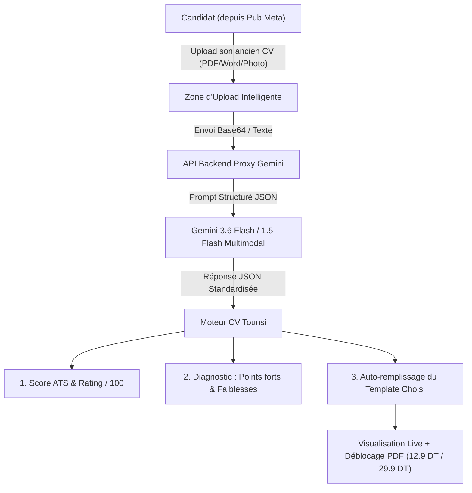

# 📊 Rapport Stratégique & Technique : Scanner & Analyseur de CV par IA
**Projet :** CV Tounsi (`cv-tounsi-service`)  
**Fonctionnalité étudiée :** Import de CV existant ➔ Analyse & Rating IA (Score ATS / 100) ➔ Diagnostic complet ➔ Extraction automatique vers les nouveaux templates.  
**Date :** 05 Septembre 2026  
**Auteur :** Antigravity AI — Pair Programming Assistant  

---

## 1. Vue d'Ensemble & Faisabilité Technique

### 1.1 Est-ce techniquement possible ?
**OUI, à 100%.**  
Grâce au moteur **Google Gemini** déjà intégré sur CV Tounsi via `/api/ai/generate`, l'IA dispose de capacités **multimodales natives** (vision + texte). Elle est capable de lire un fichier (PDF vectoriel, document Word converti, ou même scan/photo d'un CV papier), d'analyser son contenu en quelques secondes, de lui attribuer un score de performance, et de renvoyer un objet JSON strictement formaté selon la structure de données `CvData` existante de l'application.



---

## 2. Les Avantages Majeurs (Business, Marketing & UX)

| Avantage | Impact sur CV Tounsi |
| :--- | :--- |
| **🎯 Alignement parfait avec la publicité Meta** | La promesse publicitaire devient irrésistible : *"اختبر قوة الـ CV متاعك مجاناً : حط سيرتك الذاتية وشوف النوتة متاعها ونقاط الضعف، والذكاء الاصطناعي يرجعهالك في قالب كندي/أوروبي احترافي في 10 ثواني"*. Le CTR (taux de clic) explose. |
| **⚡ Éradication du syndrome de la page blanche** | Sur smartphone, taper 5 ans d'expériences et de formations sur un petit clavier est la cause n°1 d'abandon. L'auto-remplissage réduit l'effort utilisateur de **80%**. |
| **🎮 Gamification par le Score (Rating ATS)** | Afficher un score psychologique (ex: **52/100** avec mentions d'erreurs réelles : manque de mots-clés, mise en page non reconnue par les robots ATS) crée un déclic d'urgence immédiat pour corriger et télécharger la version optimisée. |
| **💰 Boost massif du taux de conversion (Paywall)** | L'analyse et la notation sont gratuites (aimant à prospects / Lead Magnet). Le nouveau CV généré est visible immédiatement avec le design CV Tounsi. Pour télécharger la version finale propre sans filigrane, le client passe naturellement au paiement D17/Flouci (12.9 DT / 29.9 DT). |

---

## 3. Les Inconvénients & Risques Techniques Spécifiques (À Anticiper)

> [!WARNING]
> La réalité du marché tunisien impose d'anticiper plusieurs contraintes techniques majeures pour éviter tout blocage ou déception utilisateur.

### 1. La diversité et la faible qualité des fichiers sources
- En Tunisie, beaucoup d'utilisateurs ont :
  - Des CVs au format **Word (.doc/.docx)** avec des tableaux imbriqués.
  - Des CVs faits sur Canva exportés en **images plates / PDF non vectoriels** (impossible d'extraire le texte avec un parseur PDF classique sans OCR).
  - Des photos prises avec leur smartphone d'une feuille papier.
- **Solution requise :** Ne pas se contenter d'une simple bibliothèque d'extraction de texte (comme `pdf-parse` qui échouerait sur 40% des fichiers). Il faut envoyer le fichier sous forme de base64 directement à Gemini en mode vision/multimodal pour qu'il effectue un OCR automatique.

### 2. Le temps d'attente (Latence 4G sur Mobile)
- Uploader un fichier de 2 à 4 Mo sur un réseau 3G/4G tunisien, puis attendre l'analyse Gemini peut prendre entre **6 et 10 secondes**.
- Si l'écran reste figé, l'utilisateur pense que le site a buggé et quitte.
- **Solution requise :** Une jauge de progression visuelle animée et rassurante en 3 temps :
  1. *« 📄 جاري قراءة محتوى السيرة الذاتية... »* (0-3s)
  2. *« 🧠 الذكاء الاصطناعي يحلل نقاط القوة والـ ATS... »* (3-7s)
  3. *« ✨ جاري نقل بياناتك إلى القالب الجديد... »* (7-10s)

### 3. Les limites de taille de payload sur Vercel (4.5 MB Limit)
- Si le projet est déployé sur Vercel ou un environnement serverless, la taille maximale d'une requête HTTP est de **4.5 Mo**. Si un client uploade un PDF scanné de 8 Mo, Vercel retournera une erreur `413 Payload Too Large`.
- **Solution requise :** Valider la taille du fichier côté client (< 4 Mo) avec un message d'alerte en arabe clair si le fichier dépasse cette taille.

### 4. Les imperfections de parsing (Hallucinations mineures)
- L'IA peut parfois intervertir un intitulé de poste avec le nom de l'entreprise, ou fusionner deux dates.
- **Solution requise :** L'utilisateur doit impérativement être redirigé vers l'éditeur existant pour pouvoir relire, ajuster ou corriger les champs avant l'export.

---

## 4. Degré de Liaison avec l'Architecture Actuelle

Le degré d'intégration avec la codebase existante est **EXCEPTIONNELLEMENT ÉLEVÉ (95% compatible)** :

```text
[Architecture Actuelle]
├── client/src/pages/Home.tsx (Gère l'état 'data: CvData' avec tous les champs)
├── client/src/lib/gemini.ts (Gère la communication avec l'API Gemini)
├── server/index.ts (Endpoint proxy /api/ai/generate déjà fonctionnel)
└── client/src/pages/ServiceOrderPage.tsx (Possède déjà un composant d'upload de fichier)
```

1. **Structure de données 100% alignée :**  
   Le schéma TypeScript `CvData` dans `Home.tsx` (`fullName`, `email`, `phone`, `location`, `targetRole`, `summary`, `experiences[]`, `education[]`, `skills[]`, `languages[]`) servira directement de schéma JSON cible pour Gemini.
2. **Aucune régression sur le reste :**  
   Une fois les données extraites et injectées dans `setData(...)`, tous les composants existants (les 9 templates, la prévisualisation temps réel, le téléchargement PDF A4 et le paywall 12.9 / 29.9 DT) fonctionnent **exactement comme aujourd'hui** sans la moindre modification.

---

## 5. Recommandation & Verdict : Faut-il l'intégrer ?

### 🏆 Verdict : OUI, TRÈS FORTEMENT RECOMMANDÉ !
C'est le levier de conversion le plus puissant possible pour rentabiliser vos campagnes Meta Ads. La majorité des chercheurs d'emploi en Tunisie possèdent déjà une ébauche de CV et veulent savoir **pourquoi ils ne décrochent pas d'entretiens** et **comment le transformer rapidement**.

### 🛣️ Feuille de route recommandée (Approche Hybride & Sans Risque)

Pour ne pas déstabiliser les clients qui partent de zéro, il est recommandé de proposer un **Double Choix d'Entrée (Step 0)** :

```text
┌─────────────────────────────────────────────────────────────┐
│                 كيفاش تحب تبدأ الـ CV متاعك ؟              │
├──────────────────────────────┬──────────────────────────────┤
│  ⚡ الخيار الأول (الموصى به)  │  ✍️ الخيار الثاني             │
│  عندي CV قديم نحب نطوّرو     │  نحب نصنع CV جديد من الصفر   │
│                              │                              │
│  • ارفع الـ PDF أو Word       │  • تعمير خطوة بخطوة          │
│  • نوتة وتحليل ATS فوري      │  • مساعدة الذكاء الاصطناعي   │
│  • نقل آلي للقالب الجديد     │  • اختيار القالب المناسب     │
│                              │                              │
│  [ ارفع سيرتك الذاتية 📄 ]   │  [ ابدأ من الصفر ➔ ]         │
└──────────────────────────────┴──────────────────────────────┘
```

---

## 6. Synthèse des Éléments à Implémenter (Spécifications Techniques)

1. **Côté Serveur (`server/index.ts`) :**
   - Un endpoint dédié `/api/ai/analyze-cv` acceptant le fichier en Base64 / PDF / Texte.
   - Un prompt Gemini configuré pour renvoyer :
     ```json
     {
       "score": 68,
       "feedback": {
         "strengths": ["خبرة واضحة في مجال المبيعات", "معلومات الاتصال كاملة"],
         "weaknesses": ["غياب الأرقام والنتائج المحققة", "النموذج غير متوافق مع أنظمة ATS"],
         "recommendation": "تحويل السيرة الذاتية إلى النموذج الكندي الحديث مع إعادة صياغة المهام."
       },
       "extractedData": {
         "fullName": "...",
         "email": "...",
         "phone": "...",
         "targetRole": "...",
         "summary": "...",
         "experiences": [...],
         "education": [...],
         "skills": [...],
         "languages": [...]
       }
     }
     ```
2. **Côté Interface (`client/src`) :**
   - Une modale ou carte d'upload intuitive avec glisser-déposer (Drag & Drop) acceptant PDF, DOCX et JPG/PNG (< 4MB).
   - Un écran de résultat dynamique affichant le badge de score (ex: `68/100 - قابل للتحسين ⚠️`) et les 3 conseils clés.
   - Un bouton d'action : `🚀 انقل بياناتي وصلّح الـ CV في النموذج الجديد` qui injecte les données et bascule directement sur l'éditeur avec le modèle recommandé.
