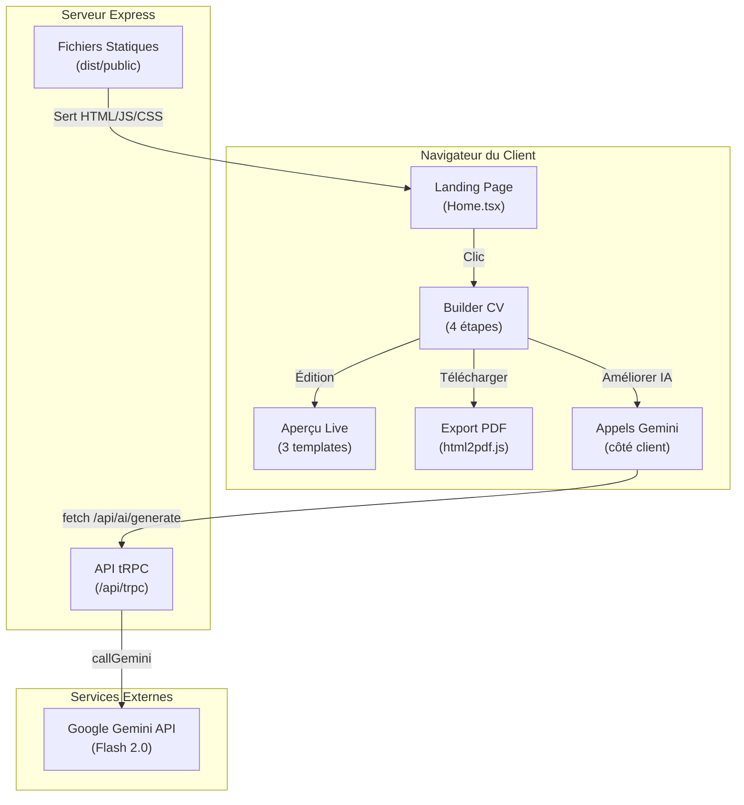

# 📋 Rapport d'Audit SaaS — CV Tounsi

> **Objectif :** Transformer CV Tounsi en un vrai produit SaaS tunisien prêt à être sponsorisé sur Meta Ads.
> **Date :** 22 Août 2026
> **Auteur :** Antigravity (Audit Automatisé)

---

## 1. Architecture Actuelle du Projet

### Structure des Fichiers

```
cv-tounsi-service/
├── client/                     ← Frontend React (SPA)
│   ├── index.html              ← Point d'entrée HTML (1 page)
│   └── src/
│       ├── App.tsx             ← Routeur (wouter) : 1 seule route "/"
│       ├── main.tsx            ← Init React + tRPC client
│       ├── index.css           ← 67 Ko de styles (1 seul fichier CSS)
│       ├── pages/
│       │   └── Home.tsx        ← 112 Ko — TOUT le produit dans 1 fichier
│       ├── lib/
│       │   ├── gemini.ts       ← Appels IA côté client (via /api/ai/generate)
│       │   ├── activation.ts   ← Codes d'activation dynamiques
│       │   └── pdf.ts          ← Export PDF (html2pdf.js)
│       └── components/         ← Composants shadcn/ui (non utilisés dans Home)
├── server/                     ← Backend Express (quasi vide)
│   ├── index.ts                ← Sert uniquement les fichiers statiques
│   ├── db.ts                   ← Drizzle ORM / MySQL (non connecté)
│   ├── storage.ts              ← S3 / Manus Forge (non utilisé)
│   └── routers/cv.ts           ← Routes tRPC IA (serveur)
├── .env                        ← Clé API Gemini exposée côté client
└── package.json                ← ~80 dépendances
```

### Schéma d'Architecture



### Résumé Technique

| Aspect | Technologie | État |
|:---|:---|:---|
| **Frontend** | React 19 + Vite 7 + Vanilla CSS | ✅ Fonctionnel |
| **Backend** | Express (serveur quasi vide) | ⚠️ Minimal |
| **Base de données** | Drizzle ORM + MySQL | ❌ Non connectée |
| **Authentification** | Aucune | ❌ Inexistante |
| **Paiement** | Code d'activation (localStorage) | ⚠️ Contournable |
| **IA** | Gemini API (clé exposée côté client via VITE_) | 🔴 Vulnérable |
| **Export PDF** | html2pdf.js (client-side) | ✅ Fonctionnel |
| **Hébergement** | Local uniquement | ❌ Non déployé |
| **Analytics** | Aucun | ❌ Inexistant |
| **SEO** | Minimal (title + meta desc) | ⚠️ Insuffisant |

---

## 2. Points Forts du Projet 💪

### Ce qui est déjà bien fait :

1. **Produit fonctionnel complet** — Un utilisateur peut créer un CV de A à Z, choisir parmi 3 templates, 5 langues et exporter en PDF A4.

2. **Design & UX premium** — Le thème "Waraq Al-Zaytoun" (ورق الزيتون) est visuellement professionnel, cohérent et adapté au marché tunisien. Le design éditorial méditerranéen est distinctif et mémorable.

3. **Différenciation Profil Expérimenté / Étudiant** — Fonctionnalité rare dans les outils gratuits tunisiens. Chaque profil a ses propres sections, prompts IA et structure.

4. **IA intégrée** — L'amélioration automatique des textes (accroche, expériences, compétences, harmonisation) est un vrai avantage compétitif. Peu de concurrents tunisiens l'offrent.

5. **Multi-templates & Multi-langues** — Professionnel, Canadien, Europass × Français, Anglais, Allemand, Italien, Arabe. Couverture large.

6. **Expérience Mobile** — Le mode téléphone avec le mockup device est une fonctionnalité différenciante pour les utilisateurs mobile (70%+ du trafic tunisien).

7. **Édition directe sur l'aperçu** — Cliquer sur n'importe quel texte du CV pour le modifier est une UX avancée.

8. **Système de monétisation pensé** — Le flux WhatsApp + code d'activation + PDF flouté est adapté au marché tunisien où le paiement en ligne est limité.

---

## 3. Points Faibles & Risques Critiques 🚨

### 🔴 CRITIQUE — Sécurité

| Problème | Gravité | Impact |
|:---|:---|:---|
| **Clé API Gemini exposée dans le code client** (`VITE_GEMINI_API_KEY` dans `.env`) | 🔴 CRITIQUE | N'importe qui peut ouvrir DevTools, copier votre clé et l'utiliser. Vos crédits seront épuisés en quelques heures après le lancement des ads. |
| **Validation du code d'activation 100% côté client** | 🔴 CRITIQUE | Un utilisateur peut ouvrir la console, taper `localStorage.setItem("cv_tounsi_client_unlocked","true")` et débloquer le produit gratuitement. |
| **Protection anti-screenshot contournable** | 🟡 MOYEN | Tout développeur peut désactiver les event listeners ou utiliser un outil de capture externe. C'est une protection dissuasive, pas réelle. |
| **PDF généré 100% côté client** | 🟡 MOYEN | Le flou est appliqué via CSS. En inspectant le DOM, on peut retirer la classe `.pdf-blurred-sheet` et exporter le PDF net. |

### 🟡 STRUCTUREL — Architecture

| Problème | Impact |
|:---|:---|
| **Home.tsx = 112 Ko / 3074 lignes** | Fichier monolithique impossible à maintenir. Tout le produit (landing, builder, 4 étapes, 3 templates, IA, paywall, PDF) est dans UN fichier. |
| **Aucune base de données active** | Drizzle est configuré mais non connecté. Aucun CV n'est sauvegardé. Si le client ferme son onglet, tout est perdu. |
| **Aucun système d'authentification** | Pas de login, pas de comptes utilisateurs, pas de sessions. Impossible de suivre les clients ou de gérer les accès. |
| **Aucun tracking / analytics** | Vous ne saurez pas combien de visiteurs arrivent depuis Meta Ads, combien créent un CV, combien cliquent sur WhatsApp. |
| **Serveur quasi vide** | Le backend Express ne fait que servir des fichiers statiques. Toute la logique est côté client = 0 contrôle côté serveur. |

### 🟠 BUSINESS — Monétisation

| Problème | Impact |
|:---|:---|
| **Pas de vrai système de paiement** | Tout est manuel via WhatsApp. Ça ne scale pas au-delà de 10-20 clients/jour. |
| **Code d'activation trop permissif** | La règle 4 accepte tout code commençant par TN/CV/PRO/VIP ou finissant par 19 avec 4+ caractères. N'importe qui peut deviner `TN1234` ou `ABCD19`. |
| **Aucune limite d'utilisation de l'IA** | Un utilisateur peut cliquer sur "Améliorer" des centaines de fois, consommant vos crédits Gemini sans limites. |

---

## 4. Rating Global Actuel

```
╔══════════════════════════════════════════════════════╗
║                   CV TOUNSI — RATING                 ║
╠══════════════════════════════════════════════════════╣
║                                                      ║
║   🎨 Design & UX         ████████████░░░  8.5 / 10  ║
║   ⚡ Fonctionnalités      ███████████░░░░  7.5 / 10  ║
║   🔒 Sécurité             ██░░░░░░░░░░░░  2.0 / 10  ║
║   🏗️ Architecture          ███░░░░░░░░░░░  3.0 / 10  ║
║   💰 Monétisation         ████░░░░░░░░░░  4.0 / 10  ║
║   📊 Analytics & SEO      █░░░░░░░░░░░░░  1.5 / 10  ║
║   🚀 Prêt pour Production ██░░░░░░░░░░░░  2.0 / 10  ║
║   📱 Prêt pour Meta Ads   ██░░░░░░░░░░░░  2.0 / 10  ║
║                                                      ║
║   ─────────────────────────────────────────────────  ║
║   📊 NOTE GLOBALE SaaS     ████░░░░░░░░░  3.8 / 10  ║
║                                                      ║
╚══════════════════════════════════════════════════════╝
```

> **Verdict :** Le produit a un **excellent potentiel visuel et fonctionnel**, mais il est actuellement un **prototype local avancé**, pas un SaaS. Il manque les fondations techniques essentielles pour être mis en production et sponsorisé.

---

## 5. Ce qui Manque pour Devenir un Vrai SaaS

### 🏗️ Infrastructure Obligatoire

| Élément | Pourquoi c'est nécessaire | Complexité |
|:---|:---|:---|
| **Hébergement en ligne** (Vercel, Railway, VPS Tunisien) | Sans ça, personne ne peut accéder au site | 🟢 Facile |
| **Nom de domaine** (ex: cvtounsi.tn ou cvtounsi.com) | Crédibilité + obligatoire pour Meta Ads | 🟢 Facile |
| **Certificat SSL (HTTPS)** | Obligatoire pour Meta Ads et la confiance client | 🟢 Auto (Vercel/Cloudflare) |
| **Base de données connectée** | Sauvegarder les CVs, les clients, les codes d'activation | 🟡 Moyen |
| **Authentification utilisateur** | Comptes clients, historique, accès payant | 🟡 Moyen |

### 🔒 Sécurité Obligatoire

| Élément | Pourquoi c'est nécessaire |
|:---|:---|
| **Déplacer les appels Gemini côté serveur** | La clé API ne doit JAMAIS être dans le code client |
| **Validation des codes d'activation côté serveur** | La vérification en localStorage est contournable en 5 secondes |
| **Génération du PDF côté serveur** (Puppeteer / Playwright) | Le client ne doit pas pouvoir manipuler le DOM pour retirer le flou |
| **Rate limiting sur l'IA** | Limiter à 5-10 améliorations par session pour protéger vos crédits |

### 📊 Analytics & Tracking (Obligatoire pour Meta Ads)

| Élément | Pourquoi c'est nécessaire |
|:---|:---|
| **Meta Pixel (Facebook Pixel)** | Tracker les conversions depuis vos campagnes Meta Ads |
| **Google Analytics 4** | Comprendre le parcours utilisateur (pages vues, temps, abandon) |
| **Événements de conversion** | Quand un utilisateur clique sur WhatsApp, télécharge un PDF, entre un code |
| **UTM Tracking** | Savoir quelle publicité génère le plus de ventes |

### 💰 Monétisation Améliorée

| Élément | Pourquoi c'est nécessaire |
|:---|:---|
| **Codes d'activation stockés en BDD** | Chaque code est unique, à usage unique, avec date d'expiration |
| **Dashboard administrateur** | Voir les ventes, générer des codes, suivre les clients |
| **Intégration Flouci / Konnect** | Paiement en ligne automatisé (sans WhatsApp manuel) |
| **Page de tarification claire** | Les visiteurs doivent comprendre ce qu'ils obtiennent |

### 📱 Pages Obligatoires pour Meta Ads

| Page | Pourquoi |
|:---|:---|
| **Landing page dédiée Ads** | Meta Ads redirige vers une page optimisée pour la conversion, pas la page d'accueil |
| **Page Politique de Confidentialité** | Obligatoire pour Meta Ads |
| **Page Conditions d'Utilisation** | Obligatoire pour Meta Ads |
| **Page de contact** | Recommandé pour la crédibilité |

---

## 6. Tâches par Ordre de Priorité (Roadmap)

### 🔴 Phase 1 — Fondations Critiques (Semaines 1-2)
*Sans ça, impossible de lancer.*

| # | Tâche | Effort |
|:---|:---|:---|
| 1.1 | **Sécuriser la clé API Gemini** : Supprimer `VITE_GEMINI_API_KEY` et router TOUS les appels IA via le backend Express (proxy `/api/ai/generate`) | 2h |
| 1.2 | **Déployer le projet en ligne** : Choisir un hébergement (Vercel gratuit ou VPS tunisien) + acheter un domaine (cvtounsi.tn ~25 TND/an) | 3h |
| 1.3 | **Connecter la base de données** : Activer MySQL/PostgreSQL pour stocker les codes d'activation valides côté serveur | 4h |
| 1.4 | **Valider les codes côté serveur** : Créer une route `POST /api/validate-code` qui vérifie le code en BDD au lieu du localStorage | 3h |
| 1.5 | **Ajouter un rate-limit sur l'IA** : Maximum 5 améliorations par IP par heure | 1h |

### 🟡 Phase 2 — Tracking & Meta Ads (Semaine 3)
*Obligatoire pour lancer les publicités.*

| # | Tâche | Effort |
|:---|:---|:---|
| 2.1 | **Installer le Meta Pixel** | 30min |
| 2.2 | **Ajouter Google Analytics 4** | 30min |
| 2.3 | **Configurer les événements de conversion** : `WhatsAppClick`, `PDFDownload`, `CodeActivated`, `BuilderStarted` | 2h |
| 2.4 | **Créer une landing page Ads** optimisée avec un seul CTA clair | 4h |
| 2.5 | **Créer les pages légales** : Politique de confidentialité + CGU (en français) | 2h |

### 🟢 Phase 3 — Monétisation Solide (Semaines 4-5)
*Pour scaler au-delà de 20 clients/jour.*

| # | Tâche | Effort |
|:---|:---|:---|
| 3.1 | **Dashboard admin** : Page pour générer/voir/révoquer les codes d'activation | ✅ Fait (8h) |
| 3.2 | **Intégrer Flouci ou Konnect** : Paiement automatique en TND, code généré après paiement | ⏸️ En attente patente (6h) |
| 3.3 | **Générer le PDF côté serveur** (Puppeteer) pour une protection réelle du flou | ✅ Fait (6h) |
| 3.4 | **Système de comptes utilisateurs** (login par email ou Google) | ✅ Fait (8h) |
| 3.5 | **Sauvegarde automatique des CVs en BDD** | ✅ Fait (4h) |

### 🔵 Phase 4 — Croissance (Mois 2+)
*Pour devenir un vrai business.*

| # | Tâche | Effort |
|:---|:---|:---|
| 4.1 | **Refactoriser Home.tsx** en composants réutilisables (Landing, Builder, Steps, Preview, Paywall) | 8h |
| 4.2 | **Ajouter des témoignages clients** sur la landing page | 2h |
| 4.3 | **A/B testing** sur les landing pages Ads | Continu |
| 4.4 | **Email marketing** : Collecter les emails et relancer les utilisateurs qui n'ont pas payé | 4h |
| 4.5 | **Offres promotionnelles** : Prix de lancement 9 TND, packs famille 29 TND, etc. | 2h |

---

## 7. Estimation Budget de Lancement

| Poste | Coût estimé |
|:---|:---|
| Domaine cvtounsi.tn (1 an) | ~25 TND |
| Hébergement VPS basique (1 mois) | ~20-40 TND |
| Budget Meta Ads test (1 semaine) | ~50-100 TND |
| **Total pour démarrer** | **~100-165 TND** |

---

## 8. Conclusion & Recommandation

> [!IMPORTANT]
> **CV Tounsi est un excellent prototype avec un vrai potentiel commercial**, mais il lui manque les **fondations techniques de sécurité et d'infrastructure** pour être un SaaS.
>
> **Ne lancez PAS de Meta Ads avant d'avoir complété la Phase 1.** Si vous le faites maintenant :
> - Votre clé API Gemini sera volée et vos crédits IA épuisés
> - Les utilisateurs contourneront le paywall en 5 secondes via la console
> - Vous n'aurez aucune donnée sur vos conversions
>
> **Priorité absolue : sécuriser l'API, déployer en ligne, et installer le Meta Pixel.**

| Si vous faites les Phases 1 + 2 | Nouveau Rating |
|:---|:---|
| 🔒 Sécurité | 6.5 / 10 |
| 📊 Analytics | 7.0 / 10 |
| 📱 Prêt Meta Ads | 7.0 / 10 |
| **Note Globale** | **6.0 / 10** |

| Si vous faites aussi la Phase 3 | Nouveau Rating |
|:---|:---|
| 🔒 Sécurité | 8.0 / 10 |
| 💰 Monétisation | 8.0 / 10 |
| **Note Globale** | **7.5 / 10 — Prêt pour le marché** |
